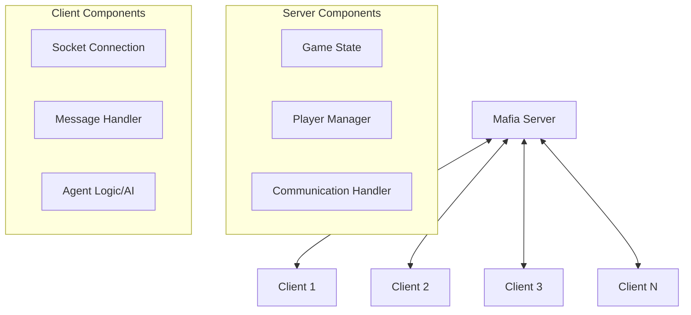
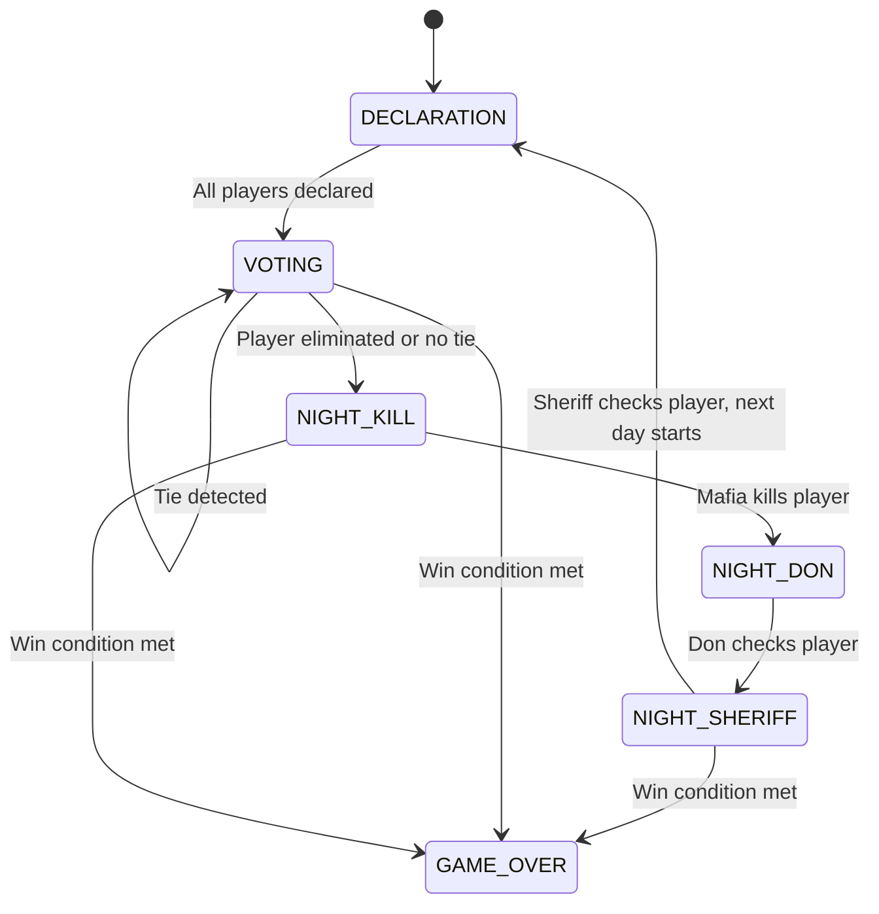
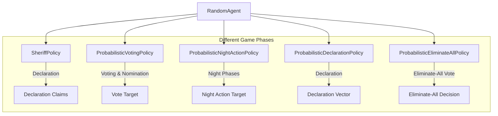
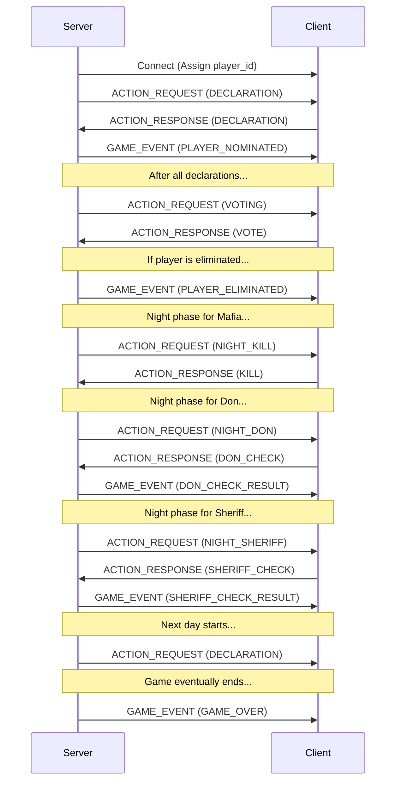

 Mafia Game Server API Documentation

## Overview

This document provides a comprehensive guide for developers to implement custom agents for the Mafia game server. It covers the communication protocol, message types, game phases, and provides examples of client-server interactions.

## Table of Contents

1. [Game Mechanics](#game-mechanics)
2. [Server-Client Architecture](#server-client-architecture)  
3. [Communication Protocol](#communication-protocol)
4. [Message Types](#message-types)
5. [Game Phases](#game-phases)
6. [Implementing a Client](#implementing-a-client)
7. [API Reference](#api-reference)
8. [Probabilistic Policy Framework](#probabilistic-policy-framework)
9. [Error Handling](#error-handling)
10. [Example Workflow](#example-workflow)
11. [Tips for Implementing Effective Agents](#tips-for-implementing-effective-agents)

## Game Mechanics

The Mafia game is a social deduction game with 10 players divided into two teams:

- **Red Team (Town)**: 7 players (6 Citizens + 1 Sheriff)
- **Black Team (Mafia)**: 3 players (2 Mafia + 1 Don)

The game progresses through a series of day and night phases. During the day, players declare beliefs, nominate suspects, and vote to eliminate players. During the night, Mafia kill a player, the Don checks if a player is the Sheriff, and the Sheriff checks if a player is on the Black team.

The game continues until one team wins:
- Red Team wins if all Black team members are eliminated
- Black Team wins if they have equal or greater numbers than the Red team

## Server-Client Architecture



The server manages the game state and coordinates all client connections. Each client represents a player in the game and communicates with the server via socket connections.

## Communication Protocol

### Connection Setup

1. The server starts and listens for connections on a specified host:port
2. Clients connect to the server via TCP sockets
3. The server assigns a player ID (0-9) to each client
4. The server sends the initial game state to all clients

### Message Format

All messages are transmitted using length-prefixed JSON:

```
[8-byte length prefix][JSON message]
```

The length prefix is an 8-byte (64-bit) unsigned integer in big-endian format indicating the size of the JSON message in bytes.

Example Python code for sending a message:

```python
def send_message(socket, message_dict):
    # Convert message to JSON
    message_json = json.dumps(message_dict)
    message_bytes = message_json.encode('utf-8')
    
    # Create 8-byte length prefix
    length_prefix = len(message_bytes).to_bytes(8, byteorder='big')
    
    # Send length prefix followed by message
    socket.sendall(length_prefix + message_bytes)
```

Example Python code for receiving a message:

```python
def receive_message(socket):
    # Read 8-byte length prefix
    length_prefix = socket.recv(8)
    if not length_prefix:
        return None  # Connection closed
        
    # Extract message length
    message_length = int.from_bytes(length_prefix, byteorder='big')
    
    # Read message
    message_bytes = socket.recv(message_length)
    
    # Parse JSON message
    message_json = message_bytes.decode('utf-8')
    return json.loads(message_json)
```

## Message Types

### Server-to-Client Messages

1. **ACTION_REQUEST**: Requests an action from a client during their turn
2. **GAME_EVENT**: Notifies clients of game events (eliminations, check results, etc.)
3. **ERROR**: Notifies a client of an error in their action

### Client-to-Server Messages

1. **ACTION_RESPONSE**: A client's response to an ACTION_REQUEST

## Game Phases

The game progresses through the following phases:



### Phase Rotation

Each phase follows a specific player rotation:

1. **Declaration Phase**: Each player takes a turn to declare beliefs and make sheriff claims
2. **Voting Phase**: Each player votes for a player to eliminate
   - If there's a tie, a second voting round occurs among tied players
   - If there's still a tie, an eliminate-all vote occurs
3. **Night Kill Phase**: Mafia team members can kill a player
4. **Night Don Phase**: The Don can check if a player is the Sheriff
5. **Night Sheriff Phase**: The Sheriff can check if a player is on the Black team
6. **Next Day**: Begins with the player AFTER the first player from the previous day

## Implementing a Client

To implement a client, you need to:

1. Connect to the server via a TCP socket
2. Handle incoming messages from the server
3. Send appropriate responses for action requests
4. Track game state based on observations and events

### Basic Client Structure

```python
import socket
import json
import threading

class MafiaClient:
    def __init__(self, host="localhost", port=8765):
        self.socket = socket.socket(socket.AF_INET, socket.SOCK_STREAM)
        self.socket.connect((host, port))
        self.player_id = None
        self.is_connected = True
        
        # Start message receiver thread
        self.receiver_thread = threading.Thread(target=self._receive_messages)
        self.receiver_thread.daemon = True
        self.receiver_thread.start()
    
    def _receive_messages(self):
        message_buffer = b""
        expected_length = None
        header_size = 8
        
        while self.is_connected:
            try:
                chunk = self.socket.recv(4096)
                if not chunk:
                    self.is_connected = False
                    break
                
                message_buffer += chunk
                
                while self.is_connected and len(message_buffer) > 0:
                    # Extract message length if needed
                    if expected_length is None:
                        if len(message_buffer) < header_size:
                            break
                        
                        length_bytes = message_buffer[:header_size]
                        expected_length = int.from_bytes(length_bytes, byteorder='big')
                        message_buffer = message_buffer[header_size:]
                    
                    # Check if we have the complete message
                    if len(message_buffer) < expected_length:
                        break
                    
                    # Process the complete message
                    message_data = message_buffer[:expected_length]
                    message_buffer = message_buffer[expected_length:]
                    expected_length = None
                    
                    message_text = message_data.decode('utf-8')
                    message = json.loads(message_text)
                    
                    self._process_message(message)
            except Exception as e:
                print(f"Error receiving message: {e}")
                self.is_connected = False
    
    def _process_message(self, message):
        message_type = message["type"]
        
        if message_type == "ACTION_REQUEST":
            self.player_id = message["player_id"]
            
            # Take action based on the request
            action = self._determine_action(message)
            self._send_action(action)
        
        elif message_type == "GAME_EVENT":
            # Update game state based on events
            event_type = message["event"]
            # Handle different event types
            
        elif message_type == "ERROR":
            print(f"Error from server: {message['message']}")
    
    def _determine_action(self, action_request):
        # Implement your agent logic here
        # Return an appropriate action based on the request
        pass
    
    def _send_action(self, action):
        response = {
            "type": "ACTION_RESPONSE",
            "player_id": self.player_id,
            "action": action
        }
        
        response_json = json.dumps(response)
        response_bytes = response_json.encode('utf-8')
        length_prefix = len(response_bytes).to_bytes(8, byteorder='big')
        
        self.socket.sendall(length_prefix + response_bytes)
```

## API Reference

### Server-to-Client Messages

#### ACTION_REQUEST

```json
{
  "type": "ACTION_REQUEST",
  "player_id": 0,
  "phase": "DECLARATION",
  "valid_actions": {
    "declaration": "vector_10",
    "sheriff_claims": "matrix_10x10",
    "nomination": [-1, 1, 2, 3, 4, 5, 6, 7, 8, 9]
  },
  "observation": {
    "turn": 0,
    "phase": "DECLARATION",
    "alive_players": [0, 1, 2, 3, 4, 5, 6, 7, 8, 9],
    "nominated_players": [],
    "tied_players": [],
    "role": "CITIZEN",
    "private_info": {},
    "players": [
      {
        "player_id": 0,
        "alive": true,
        "declarations": [0, 0, 0, 0, 0, 0, 0, 0, 0, 0],
        "sheriff_claims": [[0, 0, 0, 0, 0, 0, 0, 0, 0, 0], ...]
      },
      // ...more players
    ],
    "known_roles": {}
  }
}
```

#### GAME_EVENT

```json
{
  "type": "GAME_EVENT",
  "event": "PLAYER_ELIMINATED",
  "player_id": 3
}
```
Note: The player's role is not revealed to clients when a player is eliminated, in accordance with the game rules.

```json
{
  "type": "GAME_EVENT",
  "event": "SHERIFF_CHECK_RESULT",
  "target": 5,
  "team": "RED"
}
```

```json
{
  "type": "GAME_EVENT",
  "event": "DON_CHECK_RESULT",
  "target": 7,
  "is_sheriff": false
}
```

```json
{
  "type": "GAME_EVENT",
  "event": "GAME_OVER",
  "winner": "BLACK"
}
```

#### ERROR

```json
{
  "type": "ERROR",
  "message": "Not your turn"
}
```

### Client-to-Server Messages

#### ACTION_RESPONSE for DECLARATION

```json
{
  "type": "ACTION_RESPONSE",
  "player_id": 0,
  "action": {
    "type": "DECLARATION",
    "declaration": [1, -2, 0, 2, -1, 0, 3, -3, 1, 0],
    "sheriff_claims": [[0, 0, 0, 0, 0, 0, 0, 0, 0, 0], ...],
    "nomination_policy": {
      "1": 0.5,
      "4": 0.5
    }
  }
}
```

#### ACTION_RESPONSE for VOTE

```json
{
  "type": "ACTION_RESPONSE",
  "player_id": 0,
  "action": {
    "type": "VOTE",
    "target": 3
  }
}
```

#### ACTION_RESPONSE for ELIMINATE_ALL_VOTE

```json
{
  "type": "ACTION_RESPONSE",
  "player_id": 0,
  "action": {
    "type": "ELIMINATE_ALL_VOTE",
    "vote": true
  }
}
```

#### ACTION_RESPONSE for KILL

```json
{
  "type": "ACTION_RESPONSE",
  "player_id": 3,
  "action": {
    "type": "KILL",
    "target": 5
  }
}
```

#### ACTION_RESPONSE for DON_CHECK

```json
{
  "type": "ACTION_RESPONSE",
  "player_id": 2,
  "action": {
    "type": "DON_CHECK",
    "target": 7
  }
}
```

#### ACTION_RESPONSE for SHERIFF_CHECK

```json
{
  "type": "ACTION_RESPONSE",
  "player_id": 6,
  "action": {
    "type": "SHERIFF_CHECK",
    "target": 2
  }
}
```

## Action Types

### Declaration Actions

During the declaration phase, each player must provide:

1. **Declaration**: A vector of 10 integers (-3 to 3) representing beliefs about other players
   - -3: Strong suspicion that the player is on the Black team
   - 0: Neutral
   - 3: Strong belief that the player is on the Red team

2. **Sheriff Claims** (optional): A 10×10 matrix where each row corresponds to a turn and each column to a player, with values:
   - -1: Claim that player is on the Black team
   - 0: No claim
   - 1: Claim that player is on the Red team

3. **Nomination Policy** (optional): A mapping from player IDs to probabilities, used to nominate a player for elimination

### Voting Actions

- **Vote**: Specify a player to eliminate
- **Eliminate-All Vote**: Boolean indicating whether to eliminate all tied players

### Night Actions

- **Kill**: Specify a player to kill (Mafia role only)
- **Don Check**: Specify a player to check if they are the Sheriff (Don role only)
- **Sheriff Check**: Specify a player to check if they are on the Black team (Sheriff role only)

## Probabilistic Policy Framework

The server includes a comprehensive probabilistic policy framework that can be used to implement sophisticated agents with strategic decision-making capabilities. This framework provides classes for creating and using probability distributions over different types of actions, making it easier to develop agents that can reason under uncertainty and adapt their strategies based on game state.

### Policy Architecture

The RandomAgent implementation demonstrates how to use all these policies together:



### SheriffPolicy

The `SheriffPolicy` class handles the complex strategy of sheriff claims, particularly focusing on consistency across turns:

```python
# Create a sheriff policy for player 3 at turn 2 with all players alive
policy = SheriffPolicy.create_random_policy(
    player_id=3,
    current_turn=2,
    alive_players=list(range(10))
)

# Sample sheriff claims for the current turn
sheriff_claims = policy.sample_sheriff_claims()

# The policy maintains consistency across turns
policy.update_turn(3)  # Update to turn 3
sheriff_claims_turn3 = policy.sample_sheriff_claims()
```

Key features of the SheriffPolicy:
- Decides whether to claim sheriff on a given day
- Reveals historical checks from previous days while maintaining consistency
- Strategic lying about checks based on role and game state
- Serializable to JSON for saving/loading policies

### ProbabilisticVotingPolicy

For voting and nomination decisions, the `ProbabilisticVotingPolicy` allows agents to express preferences as probabilities:

```python
# Create a voting policy for valid targets
voting_policy = ProbabilisticVotingPolicy.create_random_policy([1, 3, 5, 7])

# Sample a concrete vote
target = voting_policy.sample_vote()

# Get the probability distribution
probs = voting_policy.target_probs  # {1: 0.2, 3: 0.3, 5: 0.1, 7: 0.4}
```

This policy can be used both for regular voting and for setting nomination preferences during the declaration phase.

### ProbabilisticNightActionPolicy

Night actions (kills and checks) use the `ProbabilisticNightActionPolicy` class:

```python
# Create a night action policy for valid targets
kill_policy = ProbabilisticNightActionPolicy.create_random_policy(
    "KILL", [1, 2, 5, 7]
)

# Sample a target (may return -1 to skip)
target = kill_policy.sample_target()
```

Note that kill policies specifically may include -1 as a special "skip" target, allowing the Mafia to strategically choose not to kill anyone in certain situations.

### ProbabilisticDeclarationPolicy

For the declaration phase, the `ProbabilisticDeclarationPolicy` helps generate belief vectors:

```python
# Create a declaration policy for 10 players
declaration_policy = ProbabilisticDeclarationPolicy.create_random_policy(10)

# Sample a declaration vector
declaration = declaration_policy.sample_declaration()
```

This policy manages the probabilities for each possible declaration value (-3 to 3) for each player position.

### ProbabilisticEliminateAllPolicy

For the eliminate-all voting phase, we provide the `ProbabilisticEliminateAllPolicy`:

```python
# Create an eliminate-all voting policy
eliminate_policy = ProbabilisticEliminateAllPolicy.create_random_policy()

# Sample a vote (True = eliminate all tied players, False = keep them)
vote = eliminate_policy.sample_vote()

# Get or set the probability of voting True
true_probability = eliminate_policy.true_prob
eliminate_policy.set_true_probability(0.75)  # 75% chance of voting to eliminate
```

This policy is simpler than the others, as it only needs to decide between True (eliminate all tied players) and False (keep all tied players).

### Creating Custom Policies

You can create custom probabilistic policies by extending these base classes. All policy classes include:

1. Methods to set specific probabilities
2. Methods to sample concrete actions
3. Serialization/deserialization to dictionaries for saving/loading
4. Factory methods to create random policies

## Error Handling

Common errors and how to handle them:

1. **Not your turn**: The client attempted to act when it's not their turn
2. **Invalid action**: The client provided an action that's not valid in the current phase
3. **Connection reset**: The connection to the server was unexpectedly closed
4. **Invalid target**: The specified target for an action is not valid

## Example Workflow



## Tips for Implementing Effective Agents

1. **Track game state**: Maintain a local copy of the game state based on observations and events
2. **Analyze player behavior**: Look for patterns in declarations, votes, and actions
3. **Use role-specific strategies**:
   - As Sheriff: Strategically reveal information to help the Red team
   - As Don: Try to identify the Sheriff and protect Mafia team members
   - As Mafia: Coordinate kills and avoid suspicion
   - As Citizen: Observe and deduce who might be on the Black team

4. **Handle uncertainty**: The game involves incomplete information, so your agent should reason under uncertainty
5. **Adapt to player eliminations**: Your strategy might need to change as players are eliminated
6. **Leverage the probabilistic policy framework**: Use the provided policy classes to implement more sophisticated agents that can reason about probabilities and make strategic decisions
7. **Combine policies intelligently**: The RandomAgent demonstrates how different policy objects can work together to create a cohesive agent strategy

### Advanced Agent Techniques

Beyond the probabilistic policies, advanced agents might consider:

1. **Bayesian updating**: Update beliefs about player roles as evidence accumulates
2. **Policy gradients**: Learn better policies through reinforcement learning
3. **Counterfactual reasoning**: Reasoning about what would have happened under different circumstances
4. **Opponent modeling**: Building models of other players' strategies
5. **Mixed strategies**: Using different strategy models depending on game state
6. **Meta-strategies**: Adapting your strategy based on the strategies you observe from other players

---

By following this documentation, you should be able to implement a client that can connect to the Mafia game server and participate in the game. The server handles the game mechanics and communication, while your client implements the decision-making logic for a player.
